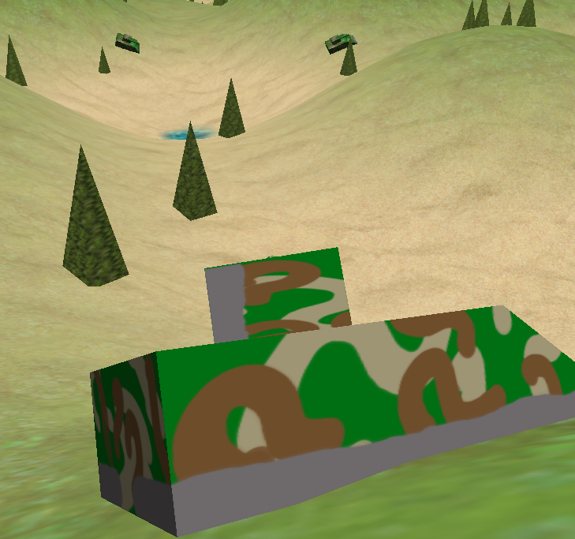
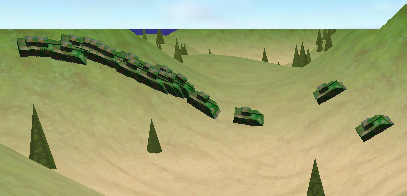
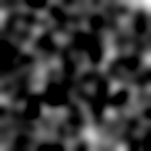
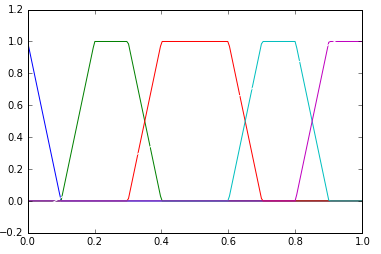
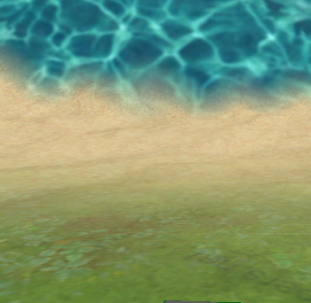
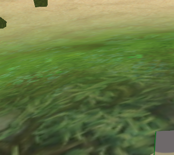

# 1. Introduction

To make a simple tanks game, where the player controls a tank that moves over an heightmap-based terrain and destroys enemy tanks.

The main mandatory features implemented are:

- Articulated boxed tank composed of body, turret and cannon, controlled by the player.
- Natural objects: trees.
- Shoots that hit terrain.
- Enemy tanks with simple AI.
- Shoots and explosions.
- Skydome.

# 2. Background information

To make this simple game, fragment and vertex shaders were implemented, as well as a basic graphics engine and the required game logic, in C++14. Also, some multimedia objects were borrowed from the internet (textures) or from the course material, and some were made for the project (like the tank model and the trees) in Blender. 

# 3. About implementation

## Tools used

- CLion editor.
- Blender.

## Program structure

- `main.cpp` is the compiled file. Basically, it initializes everything and then launchs the `glutMainLoop()`.
- `game.*` holds the state of the game. It is also responsible to init, update and draw the game.
- `graphics.*` is the graphic engine. It initializes the window, loads the shaders and media files, manages the lighting and materials and draws the objects.
    - `lab.frag` and `lab.vert` are the fragment and vertex shaders, respectively. 
- `interface.*` binds the user inputs with the player's tank movements.
- `entity.*` implements `Entity`, the basic class of anything renderable in the game. It also includes the global object `Entity::world`, that acts as a root to hold every other object.
- `entities.*` implements the concrete classes for all the types of objects in the game. These are:
    - `Camera` implements a camera that follows an entity.
    - `Box` implements a skybox. 
    - `Terrain` implements a terrain. It can be loaded from a file or generated automatically by filtering random noise.
    - `Vehicle` implements an model aligned to the terrain with some inertia and friction.
    - `Bullet` is a model that advance affected by gravity until touches the terrain or go below height 0.
    - `Explosion` is a model that destroys nearby trees and enemies and grows.
    - `Enemy` is a vehicle with a simple artificial intelligence to chase the player.
    - `Tree` is a simple static object.
- `helpers.*` implements some useful functions to obtain some matrix transformations. `random.*` implements random real-valued numbers.

# 4. Interesting problems

## Alignement to the terrain of vehicles

It is done by calculating the terrain normals of the 4 corners of the tank and then obtaining the average normal. This give us the vertical vector. The right axis is calculated then doing the crossproduct with the direction vector of the tank. And finally the front vector (that substitudes the dir vector) is the crossproduct of the vertical and right vectors. Then a transformation matrix is calculated and used before applying the usual transformations.

## Terrain generation

The heightmap is made by applying a low-pass filter to random noise.

Then the textures are applied according to the height level of each point. Five textures are used (water, sand, grass, grass-rock, rock) each one using a different alpha texture to allow to mix them smoothly. This alpha textures are calculated applying a "membership" functions to the heightmap, which shape is trapezoidal.

# 5. Conclusions

I've done almost all mandatory features. Some features in the engine finally are underused, like the lighting: it is possible to use 8 lights simultaneously but in the end only 1 is used. It would be easy to add lighting to explosions. Also lots of effects could be added.

There is no collision detection implemented, not between tanks nor between tanks and bullets. Only between bullets and terrain, and it is implemented calculating the height of the terrain.

It would be nice to have animated textures or at least some kind of swirling effect for the water. Also it would be better if tanks could sink in it.

3D models could be vastly improved. 

The random generated terrain is quite boring for a game, it would be better to simulate some realistic feature like rivers or erosion. It is not very expensive nor difficult.
